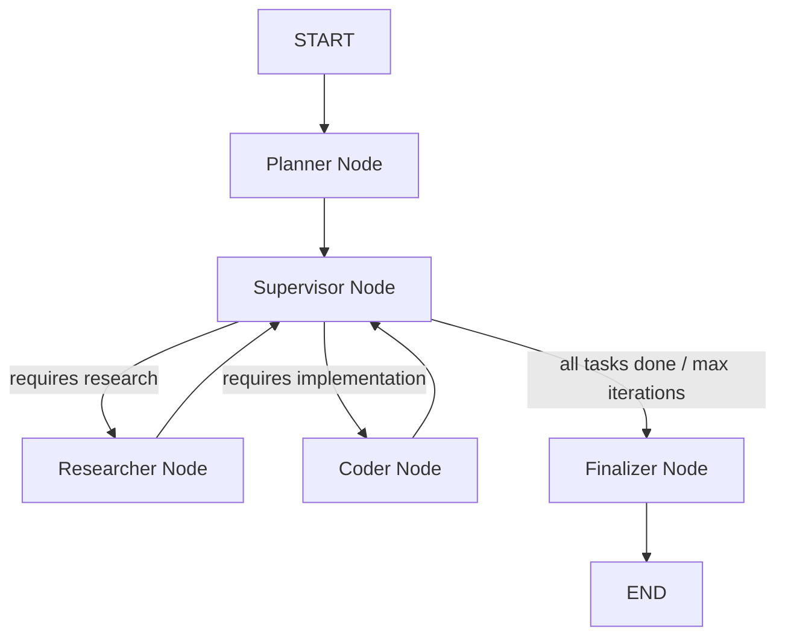

# Advanced Hybrid Multi-Agent AI Framework

A highly optimized, production-grade hybrid multi-agent system built using **LangGraph**, **LangChain**, and **Model Context Protocol (MCP)** tools. This framework implements a distributed architecture where light orchestration tasks run locally, and resource-intensive reasoning/coding tasks are delegated to cloud-based Mixture-of-Experts (MoE) models.

---

## 1. Core Architecture Pattern
The project implements a **Directed Acyclic Graph (DAG) Orchestrator-Workers pattern** using LangGraph:


* **Local Orchestration Edge**: The Planner and Supervisor control the state machine locally on your device to keep execution zero-cost, zero-latency, and strictly private.
* **Cloud Execution Boundary**: The Researcher and Coder make targeted calls to powerful cloud models when deep reasoning or extensive factual retrieval is required.
* **Role-Based Tool Boundaries**: Instead of giving all tools to all agents, tools are scoped:
  * **Research tools** (filesystem, fetch/web, github) are only available to the Researcher.
  * **Coding tools** (filesystem, github, context7/docs) are only available to the Coder.

---

## 2. Model Specifications & Deployment

The framework uses a carefully tuned configuration in [Gateway/models.py](Gateway/models.py):

| Role | Deployment | Model Name | Parameter Details | Billed Rate (1M tokens) | Key Strengths |
| :--- | :--- | :--- | :--- | :--- | :--- |
| **PLANNER** | Local (Ollama) | `cieloforge/qwen2.5-coder-7b-instruct-spec:latest` | 7B parameters (Active) | Free (Local) | Structured JSON generation, fast task breakdown. |
| **SUPERVISOR** | Local (Ollama) | `cieloforge/qwen2.5-coder-7b-instruct-spec:latest` | 7B parameters (Active) | Free (Local) | Strict schema adherence, routing decisions. |
| **RESEARCHER** | Cloud (OpenRouter) | `openai/gpt-oss-120b:free` | 117B Mixture-of-Experts (MoE) | Free (Cloud API) | Dense factual comprehension, long context parsing. |
| **CODING** | Cloud (OpenRouter) | `nex-agi/nex-n2-pro:free` | 397B total (17B Active MoE) | Free (Cloud API) | Built on Qwen 3.5; 262K context; advanced coding logic. |
| **FINALIZER** | Local (Ollama) | `gemma4:e4b` | 4B parameters (Active) | Free (Local) | Lightweight response formatting and markdown table compiling. |

### Model Technical Specifications
1. **cieloforge/qwen2.5-coder-7b-instruct-spec:latest**: A custom quantization/fine-tune of the Qwen-2.5-Coder model optimized for extreme fidelity in tool calling and JSON structured outputs. Runs on local consumer GPUs/CPUs with minimum 8GB VRAM.
2. **openai/gpt-oss-120b**: A 117B parameter MoE model that activates 5.1B parameters per token. Runs on a single quantized H100 node in the cloud. It features native tool-use capability and long-context synthesis.
3. **nex-agi/nex-n2-pro**: A state-of-the-art agentic MoE model from Nex AGI with a total of 397B parameters (17B active per forward pass). Built on the Qwen3.5 architecture, it boasts a massive 262K token context window and has unified internal planning-coding-debugging loops.

---

## 3. Detailed File-by-File Breakdown

### Root Directory
* **[main.py](main.py)**: The entry point. Initializes MCP clients, validates the `.env` configuration, constructs the LangGraph `StateGraph`, compiles the pipeline, handles top-level execution timeouts, and gracefully shuts down subprocesses (adding a `0.2s` sleep to prevent Windows Proactor pipe-close crashes).
* **[config.py](config.py)**: Houses the strict system prompts for all agents. 
  * `RESEARCH_PROMPT` enforces plain-prose outputs, a strict 250-word cap, and bans the generation of markdown or raw code to keep token usage down.
  * `CODER_PROMPT` enforces JSON-only delivery matching a schema of `{summary, run, files}`.
* **[registry.py](registry.py)**: Handles concurrent, safe initialization and lifecycle management of all MCP clients. If a client fails to connect or times out, it logs a warning but allows the system to continue running with the remaining tools.
* **[utils.py](utils.py)**: Contains standard utility logging with timestamps formatted as `[HH:MM:SS]`.
* **[wrapper.py](wrapper.py)**: Implements node-level middleware (`pii_middleware`) that automatically intercept and scrub sensitive data before returning states.
* **[requirements.txt](requirements.txt)**: Python package list.
* **[.gitignore](.gitignore)**: Explicitly ignores Python compiler caches (`__pycache__/`), environment secrets (`.env`), and the dynamic runtime directory (`workspace/`).

### Gateway Directory
* **[Gateway/llm_gateway.py](Gateway/llm_gateway.py)**: Initializes and caches `ChatOpenAI` models and agents. It maps the local-to-cloud boundary and implements `_get_api_key()` to dynamically mask key headers for local Ollama endpoints (using `SecretStr("none")`).
* **[Gateway/models.py](Gateway/models.py)**: The centralized registry mapping each `ModelRole` to a `ModelConfig` (temperature, timeout, max tokens, provider, base URL).

### Middlewares Directory
* **[Middlewares/pii.py](Middlewares/pii.py)**: Compiles regex patterns to redact sensitive personal data (emails, Aadhaar/PAN cards, credit cards, passport numbers, API keys, UPIs, JWTs, IPs) and replace them with `[REDACTED]`.

### Nodes Directory
* **[Nodes/Planner.py](Nodes/Planner.py)**: Uses structured schemas to split the user request into up to 3 atomic tasks, categorizing them into `software` or `general` domains.
* **[Nodes/supervisor_node.py](Nodes/supervisor_node.py)**: The brain of the graph. Evaluates tasks, manages the retry budget (up to 2 retries per task), and routes to the next pending node. It includes a critical patch ensuring `current_task` points to the next valid pending task even when a preceding task fails.
* **[Nodes/Researcher.py](Nodes/Researcher.py)**: Collects factual context using web/fetch tools and passes findings downstream. Injects the absolute local workspace path into the prompt to provide context.
* **[Nodes/Coder.py](Nodes/Coder.py)**: Executes code generation, attempts robust multi-level JSON parsing on the response, and automatically saves output files directly to disk inside `./workspace`.
* **[Nodes/Finalizer.py](Nodes/Finalizer.py)**: Combines final deliverables, errors, and files into a cohesive Markdown summary report.
* **[Nodes/_utils.py](Nodes/_utils.py)**: Implements graph state helper methods (e.g., matching the current active task ID, summarizing prior findings).

### Tools Directory
* **[Tools/filesystem.py](Tools/filesystem.py)**: Configures the official MCP Filesystem server to read/write safely within the designated `./workspace` path.
* **[Tools/web.py](Tools/web.py)**: Starts the MCP Fetch server for accessing and converting raw HTTP/HTTPS web endpoints to Markdown.
* **[Tools/github.py](Tools/github.py)**: Launches the MCP GitHub server for repo inspection using your `GITHUB_TOKEN`.
* **[Tools/documentation.py](Tools/documentation.py)**: Integrates the Upstash Context7 search server for looking up external documentation.

---

## 4. Execution Lifecycle & State Transition
```text
[User Request] 
      │
      ▼
[Planner Node] ────► Creates atomic task list
      │
      ▼
[Supervisor Node] ◄──────────────────────────┐
      │                                       │
      ├─► (Pending Research Task) ────► [Researcher Node] 
      │                                       │
      ├─► (Pending Coding Task) ──────► [Coder Node] (auto-saves file)
      │                                       │
      └─► (No Tasks Left / Iter Limit)        │
              │                               │
              ▼                               │
      [Finalizer Node]                        │
              │                               │
              ▼                               │
            [END] ────────────────────────────┘
```

1. **State Initialization**: The pipeline receives the `user_query`, sets the `llm_gateway`, and initializes the `tasks` list.
2. **State Updates**: When a node finishes, it returns `{"tasks": updated_tasks}`.
3. **Supervisor Validation**: The Supervisor inspects the task array. If a task fails, the supervisor retries it (max 2 times). If it runs out of retries, it force-fails it, logs the error, and advances to the next pending task.

---

## 5. Token & Cost Efficiency Analysis

The hybrid nature of the architecture makes it incredibly cost-efficient:
* **Typical Run (e.g., Generating Fibonacci Script)**:
  * **Input (Prompt + Context)**: ~12,300 tokens (12.3K)
  * **Output (Generated Code/JSON)**: ~1,075 tokens
* **Cost Comparison (in Indian Rupees & USD)**:
  * **Paid MoE Configuration (Using your exact models)**: **₹0.33** (approx. 33 Paise / $0.0039 USD)
    * *Researcher (`openai/gpt-oss-120b`):* Billed at commercial rate of $0.05/1M input, $0.18/1M output $\approx$ ₹0.02.
    * *Coder (`nex-agi/nex-n2-pro`):* Assumed equivalent commercial MoE rate of $0.40/1M input, $0.40/1M output $\approx$ ₹0.31.
  * **Commercial Low-Cost Setup** (using `gpt-4o-mini` for all cloud roles): **₹0.20** (approx. 20 Paise / $0.0024 USD)
  * **Commercial Top-Tier Setup** (using `claude-3.5-sonnet` for Coder): **₹3.86** (approx. 3 Rupees 86 Paise / $0.046 USD)

---

## 6. Installation & Prerequisites

### Prerequisites
* **Python 3.10+**
* **Node.js & npx** (required for MCP tools)
* **Ollama** installed locally (with `cieloforge/qwen2.5-coder-7b-instruct-spec:latest` and `gemma4:e4b` models downloaded)

### Quick Start
1. Clone the repository and navigate into the `Agent/` directory.
2. Create and activate a Python virtual environment:
   ```bash
   python -m venv .venv
   .venv\Scripts\activate
   ```
3. Install the packages:
   ```bash
   pip install -r requirements.txt
   ```
4. Create a `.env` file in the root directory:
   ```env
   OPENROUTER_API_KEY=your_openrouter_key
   GITHUB_TOKEN=your_github_access_token
   AGENT_TIMEOUT_SECONDS=900
   ```
5. Run the system:
   ```bash
   python main.py "your prompt here"
   ```

---

## 7. Model Context Protocol (MCP) Tool Reference

The multi-agent framework splits tool permissions dynamically using role boundaries. Below is the full catalog of MCP-provided tools available in this framework:

### A. Filesystem MCP Server (Common Tools)
These tools are exposed to **both Research and Coding agents** for working with files strictly inside the allowed `./workspace` folder:

*   **`read_file`**: Reads the raw byte contents of a file. Best for binary file inspection.
*   **`read_text_file`**: Reads text content of a file (UTF-8 encoding). Best for reading scripts, logs, or reports.
*   **`read_multiple_files`**: Batch reads the contents of multiple files in a single pass.
*   **`write_file`**: Overwrites or creates a new file at a specified path with a string payload.
*   **`edit_file`**: Applies target modifications or unified diffs directly to a file (more efficient than full rewrites).
*   **`create_directory`**: Creates a new folder or nested directory path.
*   **`list_directory`**: Lists filenames and basic types inside a folder path.
*   **`list_directory_with_sizes`**: Lists folder items including files sizes in bytes.
*   **`directory_tree`**: Generates a recursive ASCII folder tree of the workspace structure.
*   **`move_file`**: Moves or renames files and directories.
*   **`search_files`**: Performs pattern-matching search across filenames (like a local find tool).
*   **`get_file_info`**: Retrieves detailed metadata, size, timestamps, and file permissions.
*   **`list_allowed_directories`**: Outputs the exact absolute paths the filesystem server is permitted to touch.

### B. Web Fetch MCP Server (Research Tools Only)
Exposed exclusively to the **Researcher agent** for retrieving external information:

*   **`fetch`**: Downloads web page contents from any public HTTP/HTTPS URL and automatically parses and converts the HTML payload into clean, readable Markdown format for the agent to digest.

### C. Context7 Documentation MCP Server (Coding Tools Only)
Exposed exclusively to the **Coder agent** to search and retrieve documentation of python packages:

*   **`resolve-library-id`**: Translates standard package names (e.g., `langgraph`, `pandas`, `langchain`) into unique Context7 library database identifiers.
*   **`query-docs`**: Queries resolved library documentation using keywords or natural language query strings to pull function definitions, syntax specifications, and examples.

### D. GitHub MCP Server (Conditional Tools)
Exposed to **both Research and Coding agents** only when `GITHUB_TOKEN` is loaded in `.env`:

*   **`search_repositories`**: Searches public/private repositories by query string.
*   **`get_file_content`**: Reads the contents of any file directly from a Git repository branch.
*   **`search_code`**: Searches code fragments across repositories.
*   **`list_issues`**: Retrieves issue lists filtered by status, assignee, or label.
*   **`get_issue`**: Retrieves issue details, comments, and description logs.
*   **`create_issue`**: Submits a new bug report or issue to a repo.
*   **`create_pull_request`**: Submits new branch modifications as a Pull Request.

---

## 8. License

This project is licensed under the **"Work on My Machine" License (WOMML)**:
> This software is guaranteed to be fully functional, optimized, and compile without errors exclusively on the developer's local machine at the time of authoring. Any deployment, execution, or compilation on other machines is completely at your own risk and may result in occasional disappointment.
